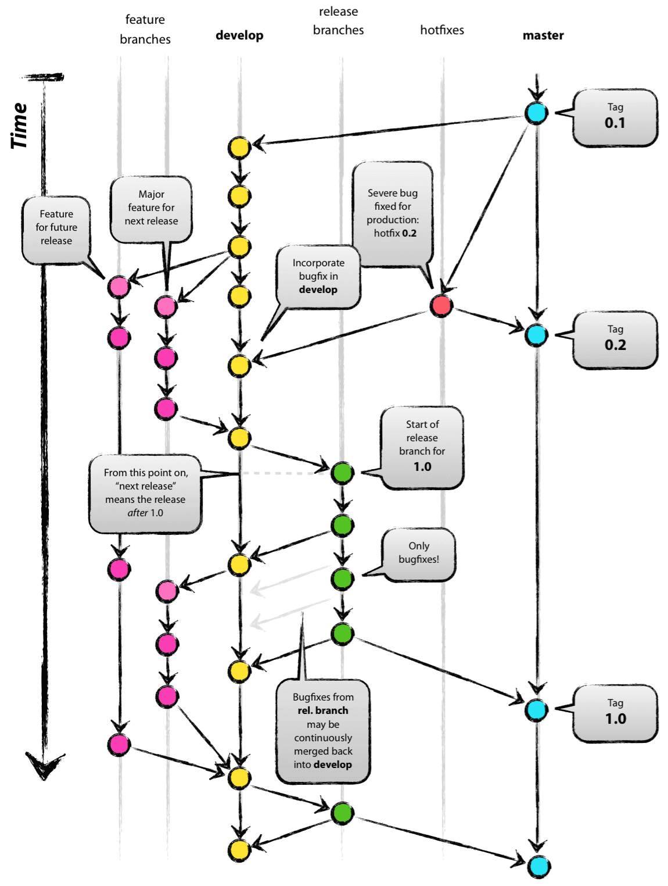

### Git branches and flow.

One of git main benefit are branches, these allow independence when working on the same software, when starting a new repository, all the changes will be committed to the main branch, but creating other branches makes developing different parts at the same time easier, and you can merge your new branch with its commits to the main branch and not affect the workflow.

Basically, a git flow has these branches: 
* Feature branch: Where developers develop features.
* Develop branch: Where developed features get collected.
* Release branch: Branch responsible for version release.
* Hotfix branch: Where online defects get corrected.
* Main branch: Where the baseline of the latest released version gets stored.

Image illustrating this flow from [this post](https://nvie.com/posts/a-successful-git-branching-model/): 

### Bibliography 
https://nvie.com/posts/a-successful-git-branching-model/
https://quangnguyennd.medium.com/git-flow-vs-github-flow-620c922b2cbd#:~:text=Unlike%20Git%2DFlow%2C%20GitHub%2D,processing%20methods%20should%20be%20similar.
https://learngitbranching.js.org/?locale=es_ES